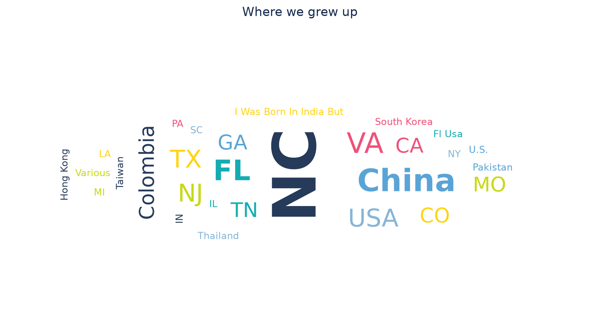
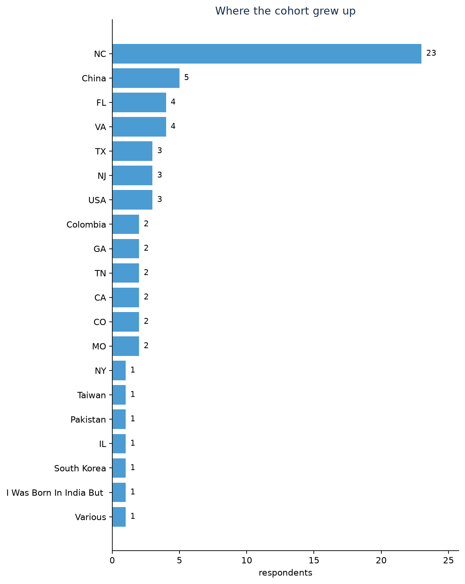
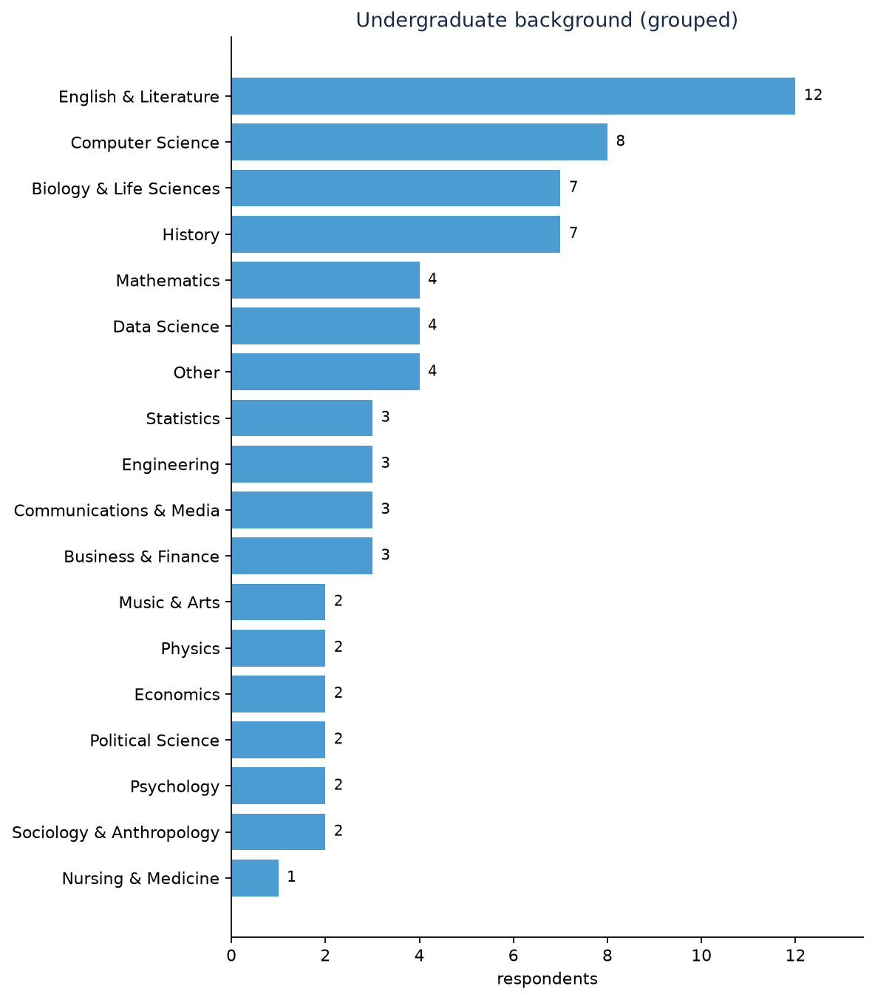
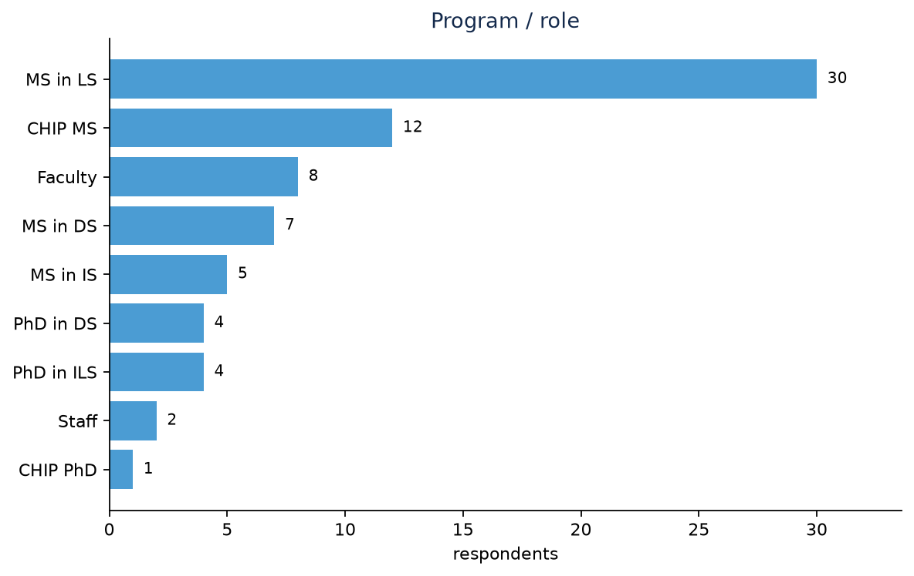
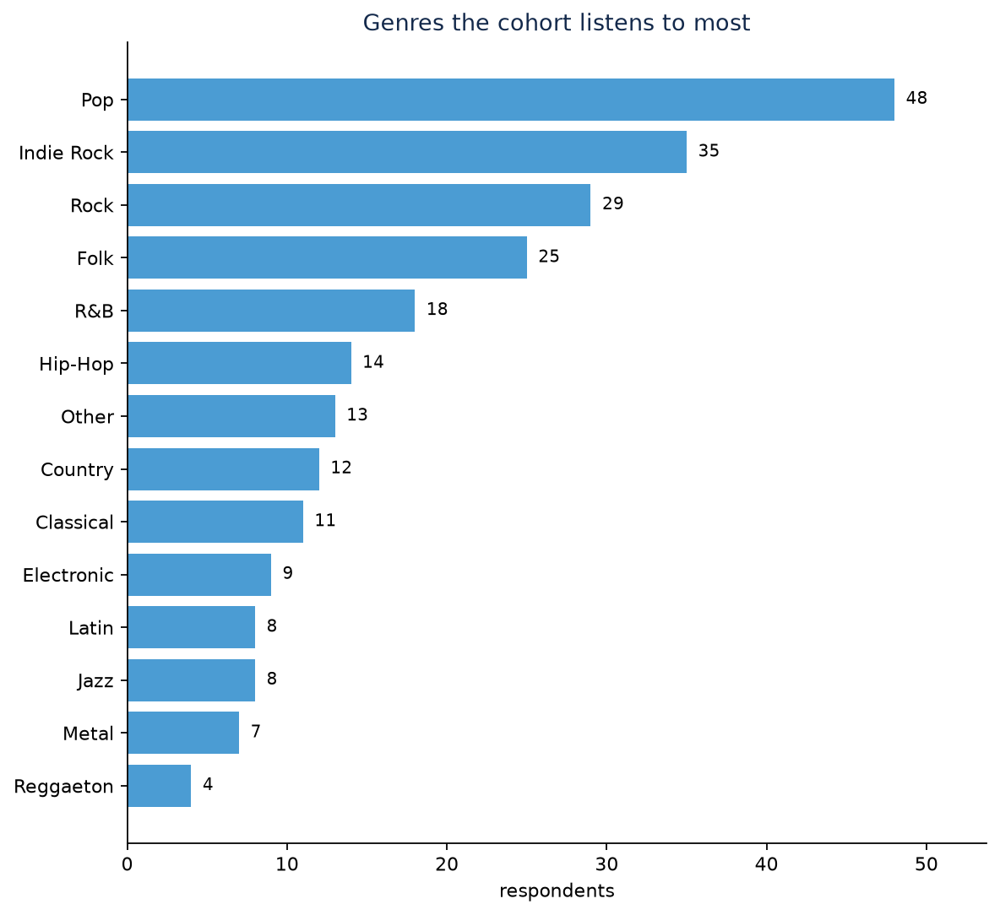

::: {.callout-note}
**73 people** have filled out the cohort survey. Last refreshed August 11, 2026 at 01:40 PM.
:::

Families are spread across 29 states and countries, most often **NC** (23), **China** (5), **FL** (4). The most common undergraduate backgrounds are **English & Literature**, **Computer Science**, **Biology & Life Sciences**. Most-listened genres: **Pop** (48), **Indie Rock** (35), **Rock** (29). 72 distinct songs were nominated for the playlist.

{fig-alt="Where the cohort grew up"}

{fig-alt="Where the cohort grew up, counted"}

{fig-alt="Undergraduate backgrounds, in respondents' own words"}

{fig-alt="Undergraduate background, collapsed into families"}

{fig-alt="Program / role"}

{fig-alt="Genres the cohort listens to most"}
