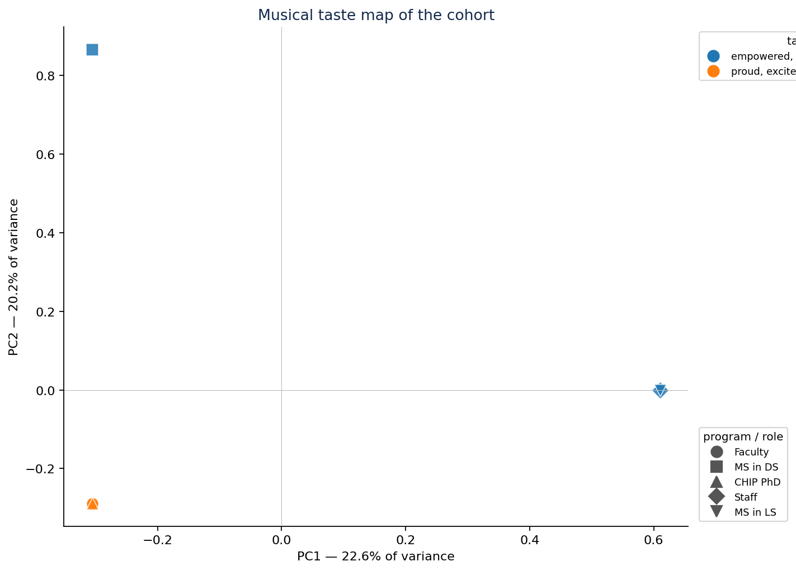
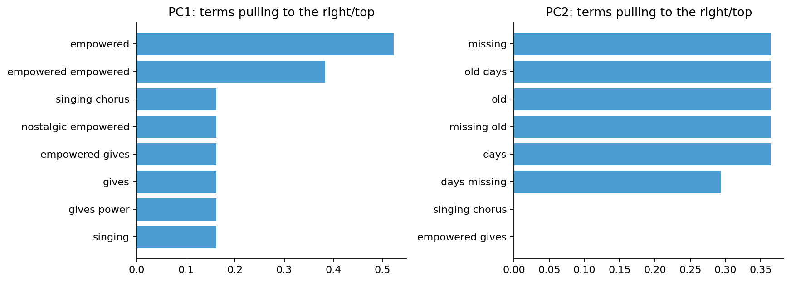

## The idea

Every person becomes a short document: **the sentence they wrote about how their
song makes them feel.** Not the genres they checked, not their program — just
the writing. That single choice is the method, and it is why the map says
something a bar chart of genres cannot. From there:

1. **tf-idf** turns each sentence into a vector. Terms almost everyone uses
   ("feel", "makes", "song") get pushed toward zero; terms that appear in a few
   answers and nowhere else carry the weight. This is what keeps the map from
   collapsing into "everyone has feelings about music."
2. **PCA** finds the directions along which those vectors vary the most, and we
   keep the top two. Distance on the resulting map is similarity of taste.
3. **k-means** on the first few components labels loose neighborhoods, named
   automatically by the terms most distinctive to each group.

The map encodes two things at once: **color is taste neighborhood** (learned
from the text) and **marker shape is program or role** (what you told us). 

<!-- That pairing is deliberate, it lets you ask whether taste tracks role at all. Most -->
<!-- years it visibly doesn't, and watching a room discover that the faculty markers -->
<!-- are scattered evenly across every musical neighborhood is worth more than a -->
<!-- slide asserting it. -->

## The map

::: {.panel-tabset}

### Interactive

```{=html}
<iframe src="docs_assets/taste_map.html" width="100%" height="620"
        frameborder="0" title="Interactive taste map"></iframe>
```

Hover any point to see the anonymous ID, the neighborhood, and the song that
person put on the playlist.

### Static

{fig-alt="Scatter plot of participants in two principal components, colored by taste neighborhood and shaped by program or role"}

:::

## Reading the axes

The components are not "genre" and "decade" — they're whatever **directions** the
data actually spreads along. Here's what came out this year:



{fig-alt="Bar charts of top tf-idf term loadings for PC1 and PC2"}

<!-- ## Caveats worth saying out loud -->

<!-- - With a cohort of a few dozen people, the components are **unstable** — one -->
<!--   person writing a long, unusual answer can rotate the map. Re-run it after the -->
<!--   next batch of responses and the axes may swap or flip sign. That's not a bug; -->
<!--   it's what small-*n* PCA does, and it's a good thing to see happen live. -->
<!-- - tf-idf sees strings, not sound. Two people who picked the *same song* but -->
<!--   described it differently land far apart, and two people with nothing musically -->
<!--   in common can land together because they both wrote about their grandmother. -->
<!--   The map measures **how people write about feeling**, not what they listen to. -->
<!--   That is a feature here, but say it out loud — it is the most common -->
<!--   misreading of a plot like this. -->
<!-- - Neighborhood names are the most distinctive terms per cluster, chosen -->
<!--   mechanically. Some are sharp; some are nonsense. Both are informative. -->
